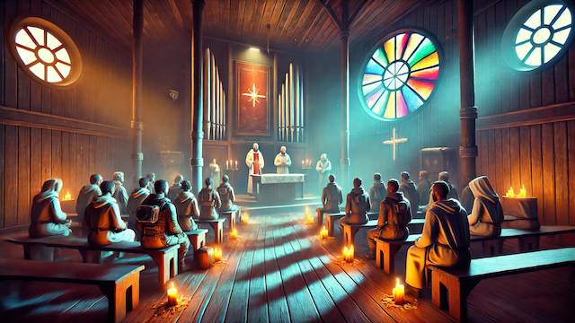

# Ideology Additions

This mod adds additional functionality to the ideology roles. 

## Moralist
### Prayer Job
Moralists can pray at a lectern providing themselves a moodboost while praying, and a lingering mood bost for all pawns in their ideoligion.

## TODO
- [ ] Only assign moralists to praying.
- [ ] Mood buff from witnessing the end of a prayer
- [ ] Watch prayer recreation type
- [ ] Confession